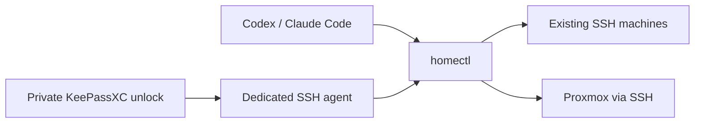

<div align="center">

# homectl

**Your homelab, operated from your AI coding agent.**

SSH into existing machines. Keep keys in KeePassXC. Unlock once for daily work.

[](https://github.com/Hiosdra/homectl/actions/workflows/ci.yml)


[Quick start](#quick-start) · [User guide](docs/user-guide.md) · [Architecture](docs/architecture.md)

</div>

---

homectl gives **Codex and Claude Code** a shared workflow for managing servers, NAS devices, printers and Proxmox VMs. A small CLI handles inventory, SSH and command review; three agent skills guide setup, enrollment and everyday operations.

Each machine has a name, purpose, access tier and cautions. Your agent can use that context when you ask:

> Check the printer's Klipper and Moonraker services before changing anything.

> Inspect the NAS disk usage and summarize what is taking space.

> Prepare a Proxmox VM plan with 4 CPUs and 8 GB RAM for me to review.

## A simpler daily routine

Unlock your SSH keys **in a private terminal**, then work through your agent or the CLI:

```sh
homectl session unlock
homectl hosts
homectl inspect lab-printer
homectl exec lab-printer -- uname -s
```

The default session lasts **24 hours**. Choose another TTL or `until-reboot`; lock it whenever you finish. Routine SSH commands use the loaded keys without reopening KeePassXC. Creating keys and editing the database are separate private operations.

| What you need | What homectl provides |
| --- | --- |
| One way to reach your machines | Named inventory and SSH aliases using existing Unix accounts |
| Credentials outside agent chat | A dedicated encrypted KeePassXC database and SSH agent |
| Different access for different hosts | `observe`, `user`, `sudo-approved` and `full` tiers |
| A chance to review changes | Dry runs and exact confirmation for destructive or opaque commands |
| Proxmox VM setup | SSH-based provisioning from an existing cloud-init template |
| Scripts as well as chat | Direct CLI commands and `--json` output |

## Quick start

Use a **Linux agent machine** with Bun 1.4.2+, OpenSSH, KeePassXC CLI, Bash and `/dev/shm` mounted as tmpfs. See [installation details](docs/user-guide.md#install) for package setup, and [manual macOS preparation](docs/user-guide.md#configuration-and-credential-storage) if needed.

### 1. Install homectl

```sh
git clone https://github.com/Hiosdra/homectl.git
cd homectl
bun install --frozen-lockfile
bun src/cli/main.ts setup
```

Setup links `homectl` and the three skills for Codex and Claude Code. Add `~/.local/bin` to `PATH` if needed, and keep the checkout at a stable location. Preview setup with `--dry-run`.

### 2. Prepare your keys privately

Run these yourself in a private terminal:

```sh
homectl session init
homectl key create lab-printer
homectl key inspect lab-printer --json
```

Initialization creates a dedicated encrypted database; skip it if yours already exists. Choose a strong password and keep an encrypted backup.

### 3. Connect your first host

Verify its SSH fingerprint through a trusted source and install the generated **public key** using your existing access. Copy [host.example.json](examples/host.example.json) outside the repository, then set its address, existing account, access tier and the exact `auth` references returned by `key inspect`.

```sh
homectl enroll lab-printer --file /path/host.json --dry-run
homectl enroll lab-printer --file /path/host.json
homectl doctor lab-printer
```

Follow the [host setup walkthrough](docs/user-guide.md#add-an-existing-ssh-host) for public-key installation, sudo configuration and NAS specifics. Once enrolled, ask your agent to use homectl for that host.

## Set the access you want

| Tier | Intended use |
| --- | --- |
| `observe` | Inspection through recognized read commands |
| `user` | Work as the existing account, without privileged commands |
| `sudo-approved` | Exact sudo commands you allow, such as service restarts |
| `full` | Administration and Proxmox provisioning |

A root SSH account requires `full`. These tiers guide command execution; actual privileges come from the account and system configuration. See [access and sudo setup](docs/user-guide.md#access-tiers).

## Make the session fit your day

```sh
homectl session configure --ttl 12h
# Or use: homectl session configure --ttl until-reboot
homectl session unlock
homectl session status
homectl session lock
```

TTL is measured from session start. Using the CLI or repeating unlock keeps the existing expiry. Changing configuration locks the current session. Lock, expiry and cold reboot stop new authentication; established SSH connections may continue.

## Provision a Proxmox VM

Enroll a full-access Proxmox SSH host, configure its provider and prepare a dedicated VM key. Fill in [vm.example.json](examples/vm.example.json), then review and apply:

```sh
homectl provision --file /path/vm.json --dry-run
homectl provision --file /path/vm.json
```

homectl uses `pvesh` over the same SSH session to clone, configure and start a VM, wait for SSH/cloud-init, and enroll it. Task journals support resuming the identical request. You need an existing cloud-init template and static network settings; see the [Proxmox walkthrough](docs/user-guide.md#proxmox-vm-provisioning-over-ssh).

## How it works



One machine runs your agent and homectl. Managed machines keep their existing accounts and need SSH access. Private keys stay encrypted in KDBX at rest and are loaded into a separate SSH agent for the session. Inventory contains references and host metadata.

## Current scope

homectl is an early project for a homelab you control. **Human confirmation is a workflow safeguard.** It does not isolate the agent or remove privileges an account already has. Other processes running as your user can use an unlocked SSH agent. Read the [credential model](docs/user-guide.md#configuration-and-credential-storage) before choosing your access tiers and TTL.

VM image import, automatic DHCP discovery and cross-node provisioning are outside the current scope. Doctor checks SSH connectivity; template readiness and real VM creation require separate verification.

## Find your next step

- **Command help:** `homectl --help` or `homectl session --help`
- **Setup, troubleshooting and recovery:** [User guide](docs/user-guide.md)
- **Configuration:** [Inventory example](examples/inventory.example.yaml)
- **Under the hood:** [Architecture](docs/architecture.md) · [Primary sources](docs/research.md)
- **Agent skills:** [Operate](skills/homelab/SKILL.md) · [Set up](skills/homelab-setup/SKILL.md) · [Enroll](skills/homelab-enroll/SKILL.md)
- **Working on the project:** [Development commands](docs/user-guide.md#troubleshooting-and-development)
