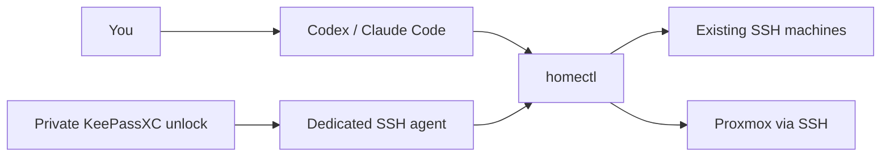

<div align="center">

# homectl

**Give your AI agent a practical way to run your homelab.**

Existing machines. Familiar SSH. One private unlock for a day of work.

[](https://github.com/Hiosdra/homectl/actions/workflows/ci.yml)


[Get started](#get-started) · [User guide](docs/user-guide.md) · [Architecture](docs/architecture.md)

</div>

---

homectl connects **Codex and Claude Code** to your servers, NAS, printers and Proxmox hosts. It combines a small CLI with three agent skills, so the agent can discover machines, understand their purpose and access level, and run commands through a consistent workflow.

Your machines keep their existing Unix accounts. SSH keys live in a dedicated **KeePassXC database**. You unlock them privately; everyday commands use a separate SSH agent for the lifetime you choose.

## What you can do

- **Ask for homelab work in plain language.** The skills guide inspection, changes and verification using `homectl`.
- **Keep useful context with each machine.** Describe its role, access tier and cautions, such as checking that a printer is idle before a restart.
- **Unlock once for daily SSH work.** Use the default 24-hour session, choose another TTL, or keep it open until reboot.
- **Review commands before running them.** Preview with `--dry-run`; destructive and opaque operations require exact confirmation.
- **Provision Proxmox VMs through SSH.** Clone a prepared cloud-init template, set resources and networking, then enroll the VM.
- **Use it directly or automate it.** The same CLI offers readable help and `--json` output.

### A typical request

Once a host is enrolled, you can ask your agent:

> Check the printer's Klipper and Moonraker services. Show me what needs attention before changing anything.

Or, with a configured Proxmox provider and template:

> Prepare a Debian VM plan with 4 CPUs and 8 GB RAM. Let me review its network and storage before creating it.

These are example requests, not recorded execution results. The skills supply the operating workflow; you supply the scope and approvals.

## How it fits together



One machine runs your coding agent and homectl. Managed hosts need existing SSH access; they do not need their own coding agents.

## Get started

**Requirements:** Bun 1.4.2+, OpenSSH, KeePassXC CLI and Bash. Automatic key creation requires Linux with `/dev/shm` mounted as tmpfs. See the [user guide](docs/user-guide.md#configuration-and-credential-storage) for manual macOS preparation.

### 1. Install on your agent machine

Install the required tools using your OS package manager. On Arch/EndeavourOS:

```sh
sudo pacman -S --needed openssh keepassxc
```

With Bun installed:

```sh
git clone https://github.com/Hiosdra/homectl.git
cd homectl
bun install --frozen-lockfile
bun src/cli/main.ts setup
```

Setup links the CLI and all three skills for Codex and Claude Code, and creates your per-user configuration. Keep the checkout at a stable path and ensure `~/.local/bin` is on `PATH`. You can preview setup with `--dry-run`.

### 2. Create your private key database

Run this **yourself in a private terminal**:

```sh
homectl session configure --ttl 24h
homectl session init
```

Choose a strong password and keep an encrypted backup. Already have a configured homectl database? Skip initialization.

### 3. Add your first machine

Prepare its dedicated key privately:

```sh
homectl key create lab-printer
homectl key inspect lab-printer --json
```

Verify the host's SSH fingerprint through a trusted source, install the generated **public key** using your existing access, and copy [host.example.json](examples/host.example.json) to a private configuration file. Set the address, existing account, desired tier and the exact `auth` references returned above.

```sh
homectl enroll lab-printer --file /path/host.json --dry-run
homectl enroll lab-printer --file /path/host.json
homectl doctor lab-printer
```

The [host setup guide](docs/user-guide.md#add-an-existing-ssh-host) walks through public-key installation, sudo configuration and NAS/Proxmox specifics.

## Your daily workflow

```sh
# Run privately when the session is locked or expired
homectl session unlock

# Then work directly, or ask your agent to use homectl
homectl hosts
homectl inspect lab-printer
homectl exec lab-printer -- uname -s

# Finish when you choose
homectl session lock
```

Tune the lifetime to your routine:

```sh
homectl session configure --ttl 12h
# Or keep keys available until lock or a cold reboot:
homectl session configure --ttl until-reboot
```

The TTL starts when a session begins and does not slide with use. Changing its configuration locks the current session. Private database/key editing still needs your password separately from routine SSH work.

## Choose access per machine

| Tier | Good fit |
| --- | --- |
| `observe` | Inspection through recognized read commands |
| `user` | Everyday work as an existing unprivileged account |
| `sudo-approved` | Specific sudo commands, such as service restarts |
| `full` | Administration and Proxmox provisioning |

A root SSH account requires `full`. Actual privileges come from the Unix account and system configuration. See [access tiers](docs/user-guide.md#access-tiers) for exact allowlists and sudo setup.

## Proxmox, using the same session

Reference an enrolled full-access Proxmox SSH host, prepare a key for the new VM and describe it using [vm.example.json](examples/vm.example.json).

```sh
homectl provision --file /path/vm.json --dry-run
homectl provision --file /path/vm.json
```

Provisioning uses node-local `pvesh` over SSH, with task journals for resuming the same request. You need an existing cloud-init template and static network settings. See the [Proxmox guide](docs/user-guide.md#proxmox-vm-provisioning-over-ssh) before your first apply.

## Know the boundaries

homectl is an early project for a homelab you control. **Human approval in the agent conversation is workflow protection, not a security sandbox.** Access tiers cannot remove privileges an account already has.

KDBX protects stored keys; an unlocked SSH agent can be used by other processes running as your user. Keep passwords out of agent chat. Lock, expiry and cold reboot stop new authentication; existing SSH connections may continue. See [credential storage](docs/user-guide.md#configuration-and-credential-storage) for the full model.

VM image import, automatic DHCP discovery and cross-node provisioning are not implemented. Doctor verifies SSH access; it does not prove a template or VM creation is ready.

## Explore further

| Looking for… | Start here |
| --- | --- |
| Command help | `homectl --help`, `homectl session --help` |
| Setup, recovery and troubleshooting | [User guide](docs/user-guide.md) |
| A complete inventory example | [inventory.example.yaml](examples/inventory.example.yaml) |
| How the components work | [Architecture](docs/architecture.md) |
| Implementation references | [Primary sources](docs/research.md) |
| Agent instructions | [Operate](skills/homelab/SKILL.md) · [Set up](skills/homelab-setup/SKILL.md) · [Enroll](skills/homelab-enroll/SKILL.md) |

For development commands and the distinction between fixture tests and real-host verification, see [development](docs/user-guide.md#troubleshooting-and-development).
